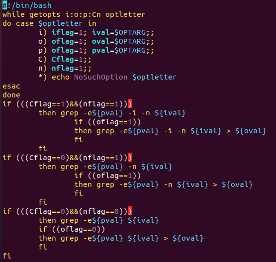
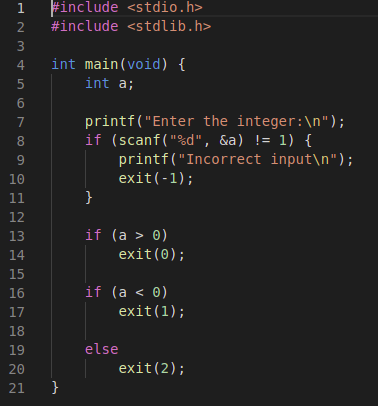
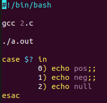
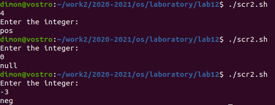
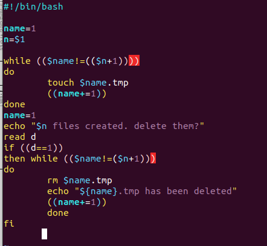
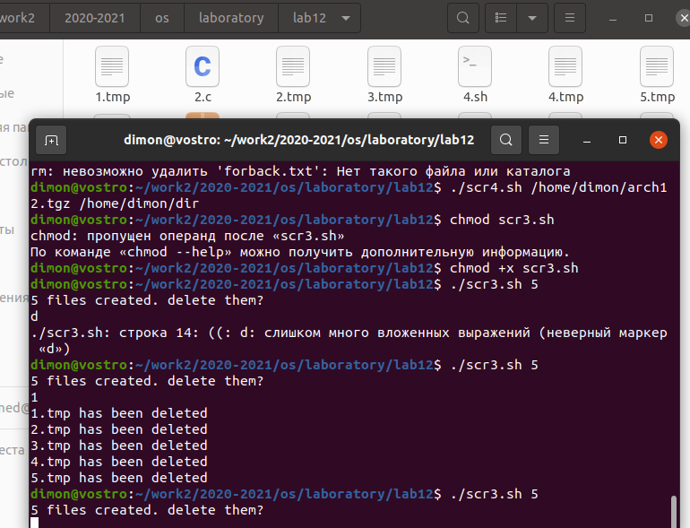
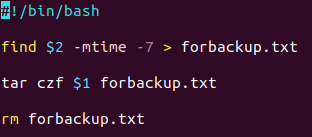
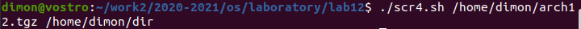
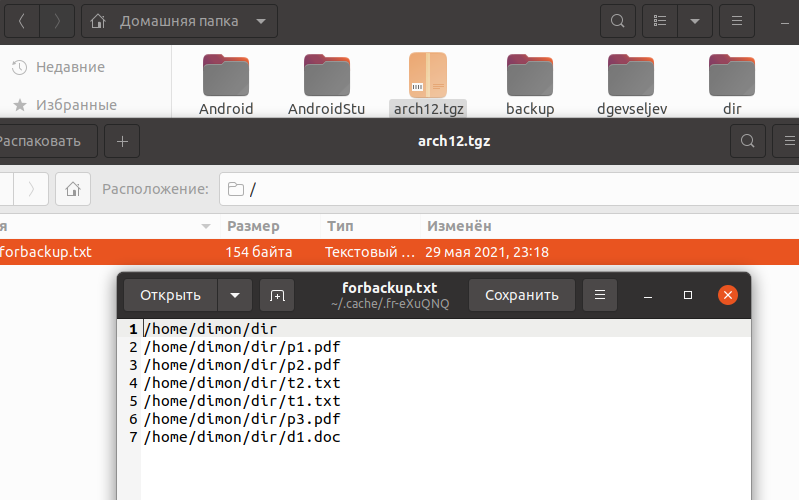

# Отчёт о выполнении лабораторной работы №12
       Программирование в командном процессоре ОС UNIX. Ветвления и циклы

***Российский Университет Дружбы Народов***  
***Факультет Физико-Математических и Естественных Наук***  

 ***Дисциплина:*** *Операционные системы*  
 
 ***Студент:*** *Евсельев Дмитрий*    
 
 ***Группа:*** *НКНбд-01-20*  
 
 
## Цель работы 
   >  Изучить основы программирования в оболочке ОС UNIX. Научится писать более сложные командные файлы с использованием логических управляющих конструкций и циклов.

## Задание 

1. Используя команды getopts grep, написать командный файл, который анализирует командную строку с ключами:
    – -iinputfile — прочитать данные из указанного файла;
    – -ooutputfile — вывести данные в указанный файл;
    – -pшаблон — указать шаблон для поиска;
    – -C — различать большие и малые буквы;
    – -n — выдавать номера строк.
а затем ищет в указанном файле нужные строки, определяемые ключом -p.

2. Написать на языке Си программу, которая вводит число и определяет, является ли оно больше нуля, меньше нуля или равно нулю. Затем программа завершается с помощью функции exit(n), передавая информацию в о коде завершения в оболочку. Командный файл должен вызывать эту  программу и, проанализировав с помощью команды $?, выдать сообщение о том, какое число было введено.

3. Написать командный файл, создающий указанное число файлов, пронумерованных последовательно от 1 до N (например 1.tmp, 2.tmp, 3.tmp,4.tmp и т.д.). Число файлов, которые необходимо создать, передаётся в аргументы командной строки. Этот же командный файл должен уметь удалять все созданные им файлы (если они существуют).

4. Написать командный файл, который с помощью команды tar запаковывает в архив все файлы в указанной директории. Модифицировать его так, чтобы запаковывались только те файлы, которые были изменены менее недели тому назад (использовать команду find).

## Выполнение работы
1. Используя команды getopts grep, написала командный файл, который анализирует командную строку с ключами:
   
   Рис.1 Анализ командной строки с ключами
   

2. Написал на языке Си программу, которая вводит число и определяет, является ли оно больше нуля, меньше нуля или равно нулю. Затем программа завершается с помощью функции exit(n), передавая информацию в о коде завершения в оболочку. Командный файл должен вызывать эту  программу и, проанализировав с помощью команды $?, выдать сообщение о том, какое число было введено.

   Рис.3 Программа на Си
   
   

   Рис.4 Командный файл
   
   

   Рис.5 Запуск командного файла
   
   

3. Написал командный файл, создающий указанное число файлов, пронумерованных последовательно от 1 до N. Число файлов, которые необходимо создать, передаётся в аргументы командной строки. Этот же командный файл умеут удалять все созданные им файлы (если они существуют).

   Рис.6 Командный файл
   
   

   Рис.7 Запуск командного файла
   
   

4. Написал командный файл, который с помощью команды tar запаковывает в архив все файлы в указанной директории. Модифицировать его так, чтобы запаковывались только те файлы, которые были изменены менее недели тому назад.

   Рис.8 Командный файл
   

   Рис.9 Запуск
   

   Рис.10 Результат
   

# Вывод
> В ходе лабораторной работы я получил изучила основы программирования в оболочке ОС UNIX/Linux, научилась писать более сложные командные файлы с использованием логических управляющих конструкций и циклов.

## Контрольные вопросы

1. Каково предназначение команды getopts? 

    Она осуществляет синтаксический анализ командной строки, выделяя флаги, и используется для объявления переменных. 

2. Какое отношение метасимволы имеют к генерации имён файлов? 

    При генерации имен файлов  используют метасимволы: 

    * 
        произвольная (возможно пустая) последовательность символов; 

    ? 
        один произвольный символ; 

    [...] 
        любой из символов, указанных в скобках перечислением и/или с указанием диапазона; 

    cat f* 
        выдаст все файлы каталога, начинающиеся с "f"; 

    cat *f* 
        выдаст все файлы, содержащие "f"; 

    cat program.? 
        выдаст файлы данного каталога с однобуквенными расширениями, скажем "program.c" и "program.o", но не выдаст "program.com"; 

    cat [a-d]* 
        выдаст файлы, которые начинаются с "a", "b", "c", "d". Аналогичный эффект дадут и команды "cat [abcd]*" и "cat [bdac]*". 

 

3. Какие операторы управления действиями вы знаете? 

    for, case, if, while 

4. Какие операторы используются для прерывания цикла? 

    Break, continue 

5. Для чего нужны команды false и true? 

    Команды ОС UNIX возвращают код завершения, значение которого может быть использовано для принятия решения о дальнейших действиях. Команда test, например, создана специально для использования в командных файлах. Единственная функция этой команды заключается в выработке кода завершения. 

 
6. Что означает строка if test -f man$s/$i.$s, встреченная в командном файле? 

    Означает условие существования файла man$s/$i.$s 

 
7. Объясните различия между конструкциями while и until. 

    Если речь идет о 2-х параллельных действиях, то это while. когда мы показываем, что сначала делается 1-е действие. потом оно заканчивается при наступлении 2-го действия, применяем until. 

#
